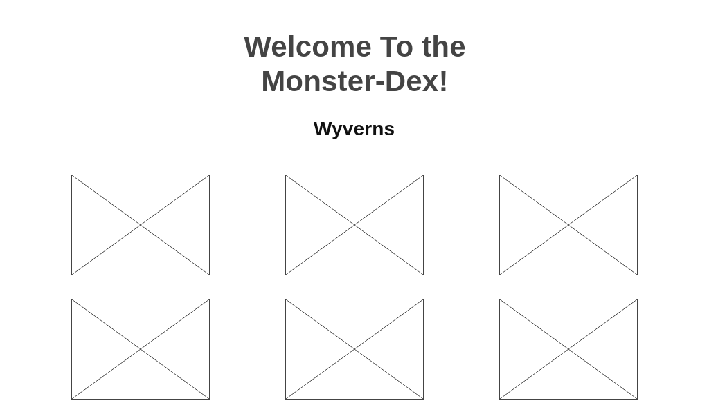

# Project-1 Monster-Dex
## Monster Hunter Themed PokeDex
### Motivation:
Since its release in early 2018, Iv'e been a hardcore fan of Monster Hunter World. Its captivating landscapes, world environment, wide variety of weapons to choose from, intricate character building, high skill cap, and of course, its huge roster of monsters to capture and/or slay has given me this never before felt immersive experience in a video game. I've accumulated over 1600 hours in Monster Hunter World and can easily say it's one of my top 5 favorite games of all time. With the task to create a project, I decided this was the perfect opportunity to create an informational catalogue for the monsters of Monster Hunter World to give users an idea of what these monsters are, how they appear in game, their habitats, what they're capable of, and what their weaknesses are.

### User Stories
* AAU(As A User), I can click on a selection of windows shown on screen to go further into the directory leading to an individual monster that displays information on the monster
* AAU, I can go to the previous page from within the directory by clicking on the left arrow icon
* AAU, I can play the personal monster theme music from within the individual monster profile by clicking on the "Play Theme" button on the bottom right of the page
* AAU, I can click the right arrow located on the right of the screen in the wyvern pages to scroll through monsters to select.

### Psuedo Code

## Wire-Frame
#### This is the first page of the site that will appear to the user
Digital WireFrame

#### After clicking on one of the wyvern types, you will be brought to this page displaying the monsters of selected wyvern type
Digital Frame

#### After clicking on a monster you will be redirected to this page displaying the slected monster's information
Digital WireFrame

